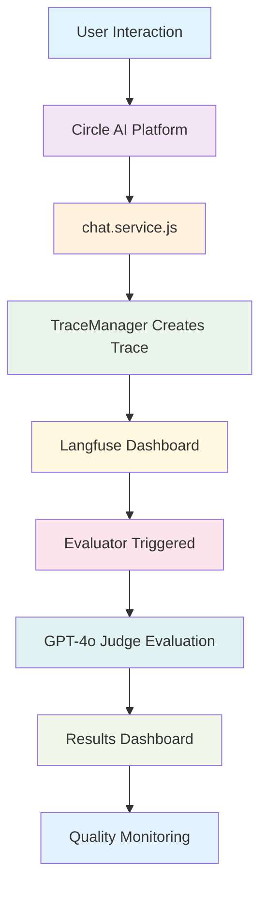
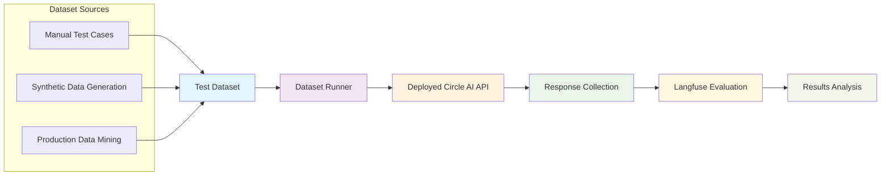
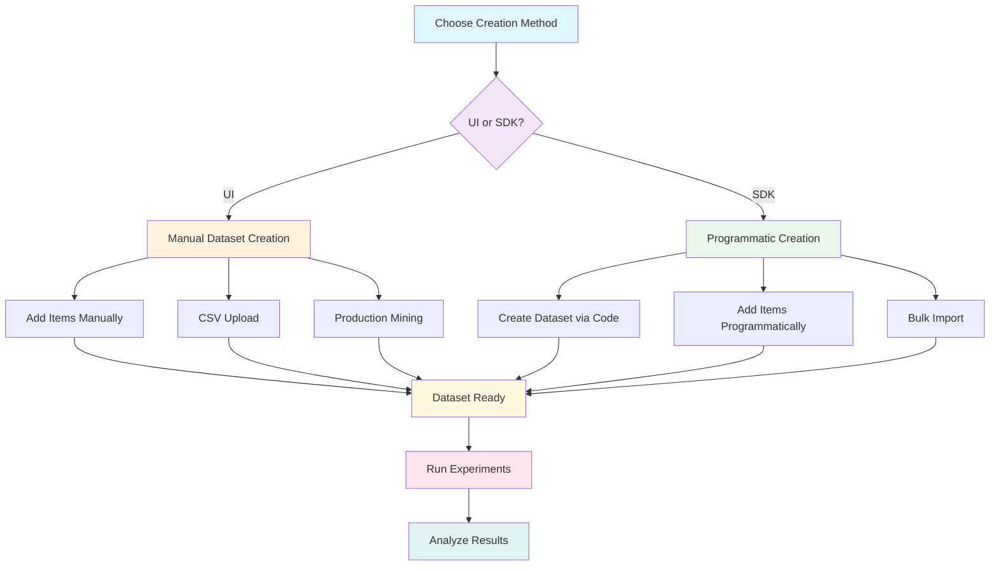
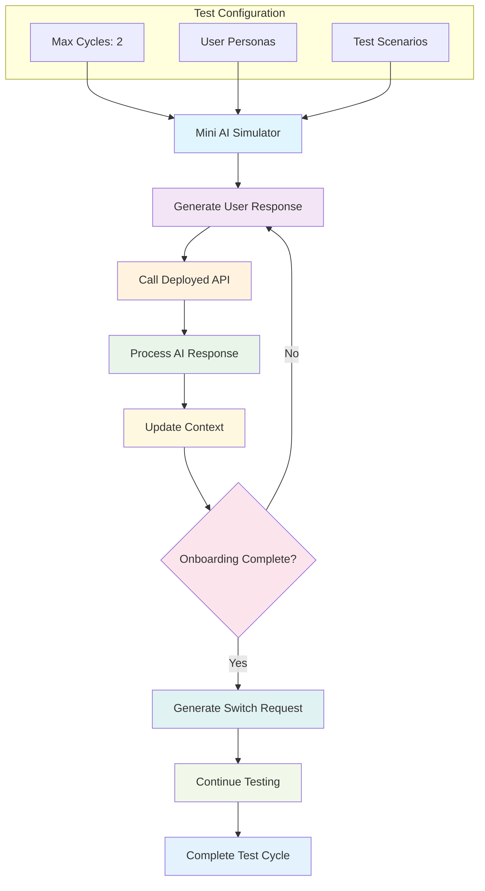
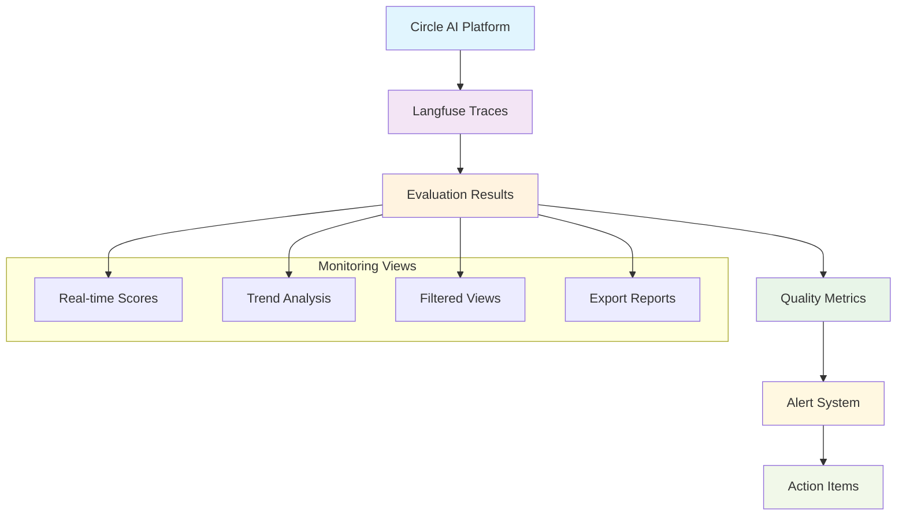

# Circle AI Evaluation Methods Documentation

## Overview

Circle AI implements three comprehensive evaluation methods to ensure high-quality user experiences and continuous platform improvement:

1. **LLM-as-a-Judge Evaluation** - Real-time quality assessment using AI judges
2. **Langfuse Dataset Evaluation** - Systematic testing with predefined test cases
3. **Mini AI User Simulator** - Automated end-to-end testing with simulated users

This document provides detailed implementation guides, configuration examples, and monitoring strategies for each evaluation method.

---

## Table of Contents

- [LLM-as-a-Judge Evaluation](#llm-as-a-judge-evaluation)
- [Langfuse Dataset Evaluation](#langfuse-dataset-evaluation)
- [Mini AI User Simulator](#mini-ai-user-simulator)
- [Integration & Monitoring](#integration--monitoring)
- [Best Practices](#best-practices)

---

## LLM-as-a-Judge Evaluation

### Overview

LLM-as-a-Judge evaluation provides real-time quality assessment of user interactions using AI-powered judges. Every user interaction is automatically evaluated for clarity, relevance, helpfulness, medical accuracy, and user experience.

### How It Works



### Real-Time Evaluation Flow

1. **User interacts** with Circle AI platform
2. **Your `chat.service.js`** creates traces with metadata
3. **Langfuse automatically** detects new traces
4. **Evaluator triggers** based on your configuration
5. **GPT-4o judge** evaluates the interaction
6. **Results appear** in Langfuse dashboard in real-time

### Trace Logging Integration

The evaluation system leverages your existing `TraceManager` implementation:

```javascript
// In chat.service.js - TraceManager initialization
traceManager = new TraceManager({
  name: "Circle AI chat",
  userId: userId,
  metadata: {
    role: updatedMetadata.roleCapabilities?.[0],
    mission: updatedMetadata.activeMission || updatedMetadata.selectedMission?.[0],
    chatHistory: messages.map(msg => `${msg.sender}: ${msg.text}`).join('\n'),
    userMessage: messages[messages.length - 1]?.text,
    aiResponse: aiResponses[0]?.text
  }
});
```

### Evaluation Prompt Templates

#### Main Evaluation Prompt

```
You are an expert evaluator assessing a medical education platform's chat system.

CONTEXT:
- Role: {{input.role}}
- Looking for: {{input.mission}}
- Chat History: {{input.chatHistory}}
- Current User Message: "{{input.userMessage}}"
- AI Response: "{{input.aiResponse}}"

EVALUATION CRITERIA:
1. **Clarity** (1-10): Is the AI's response clear and understandable?
2. **Relevance** (1-10): Does the response address the user's specific needs?
3. **Helpfulness** (1-10): Does the response guide the user effectively?
4. **Medical Accuracy** (1-10): Is any medical information accurate and appropriate?
5. **User Experience** (1-10): Does it feel natural, engaging, and professional?

Rate each criterion 1-10 and provide a brief explanation for each score.
```

#### Score Reasoning Prompt

```
Explain your reasoning for the score by briefly summarizing the AI's performance across the criteria of Clarity, Relevance, Helpfulness, Medical Accuracy, and User Experience.
```

#### Score Range Prompt

```
Based on your evaluation across all criteria, provide a single numeric score between 0 and 1, where 0 indicates a completely unsatisfactory response and 1 indicates an excellent, fully satisfactory response.
```

### Variable Mapping Configuration

Configure these variables in the Langfuse dashboard:

| Variable Name | Object | Object Variable | JsonPath |
|---------------|--------|-----------------|----------|
| `role` | Trace | Metadata | `$.role` |
| `mission` | Trace | Metadata | `$.mission` |
| `chatHistory` | Trace | Metadata | `$.chatHistory` |
| `userMessage` | Trace | Metadata | `$.userMessage` |
| `aiResponse` | Trace | Metadata | `$.aiResponse` |

### Dashboard Monitoring

The Langfuse dashboard provides real-time insights:

- **Live Traces**: New user interactions appear instantly
- **Evaluation Scores**: 0-1 scores for each interaction
- **Detailed Explanations**: Why each score was given
- **Trend Analysis**: Quality improvements over time
- **Filtering**: View by role, mission, or time period


### Evaluations Interface

The evaluations section shows detailed results and scoring:


### Prompt Configuration with Placeholders

The evaluation prompt setup includes variable placeholders for dynamic data:


### Variable Placeholders Configuration

Configure how variables are extracted from your traces:


---

## Langfuse Dataset Evaluation

### Overview

Dataset evaluation provides systematic testing using predefined test cases. This method allows for consistent evaluation of specific scenarios and comparison across different model versions.

### Dataset Evaluation Architecture



### Implementation Methods

#### Method 1: Mini AI as Dataset Runner

Extend your existing `conversation-loop-endpoint-test.js`:

```javascript
const runDatasetEvaluation = async (datasetItems) => {
  for (const testCase of datasetItems) {
    // Use your mini AI to simulate the user input
    const userInput = testCase.input;
    
    // Call your deployed endpoint
    const result = await callChatEndpoint(userId, messages, metadata);
    
    // Compare with expected output
    const evaluation = compareWithExpected(result, testCase.expectedOutput);
    
    // Send results to Langfuse
    await sendToLangfuseDataset(testCase.id, result, evaluation);
  }
};
```

#### Method 2: Direct API Testing

```javascript
const testDeployedEndpoint = async (testInput) => {
  const response = await fetch('https://your-deployed-function-url/chat', {
    method: 'POST',
    headers: { 'Content-Type': 'application/json' },
    body: JSON.stringify({
      userId: testInput.userId,
      messages: testInput.messages,
      metadata: testInput.metadata
    })
  });
  
  return await response.json();
};
```

#### Method 3: Langfuse SDK Integration

```javascript
const { Langfuse } = require('langfuse');

const langfuse = new Langfuse({
  publicKey: process.env.LANGFUSE_PUBLIC_KEY,
  secretKey: process.env.LANGFUSE_SECRET_KEY
});

const runDatasetWithLangfuse = async () => {
  // Get dataset from Langfuse
  const dataset = await langfuse.getDataset('onboarding_test_cases');
  
  for (const item of dataset.items) {
    // Use your existing test infrastructure
    const result = await runConversationLoopWithEndpoint(1);
    
    // Send evaluation to Langfuse
    await langfuse.createEvaluation({
      datasetItemId: item.id,
      result: result,
      score: evaluateResult(result, item.expectedOutput)
    });
  }
};
```

### Dataset Creation Methods

Langfuse provides multiple flexible methods for creating datasets, accommodating different workflows and preferences:

#### **Method 1: UI-Based Dataset Creation**

**UI Dataset Creation Process:**

1. **Dataset Initialization**
   - Navigate to Langfuse dashboard → Datasets section
   - Initialize new dataset with required metadata

2. **Dataset Configuration**
   ```
   Dataset Name: "circle_ai_onboarding_tests"
   Description: "Test cases for Circle AI onboarding flow"
   Metadata: {"version": "1.0", "tags": ["onboarding", "medical_education"]}
   ```

3. **Item Population Methods**
   - **Manual Entry**: Individual test case creation
   - **CSV Upload**: Bulk import for large datasets
   - **Production Mining**: Extract from existing trace data

4. **CSV Import Format**
   ```csv
   input,expected_output,metadata
   "{\"userId\":\"user1\",\"messages\":[{\"text\":\"I want to be a tutor\"}]}","{\"aiResponses\":[{\"text\":\"Great! Let's set up your tutor profile...\"}]}","{\"scenario\":\"tutor_onboarding\"}"
   "{\"userId\":\"user2\",\"messages\":[{\"text\":\"I need a tutor\"}]}","{\"aiResponses\":[{\"text\":\"I'll help you find a tutor...\"}]}","{\"scenario\":\"student_seeking_tutor\"}"
   ```

#### **Method 2: SDK-Based Dataset Creation**

**JavaScript/TypeScript SDK Implementation:**

```javascript
import { LangfuseClient } from "@langfuse/langfuse";

const langfuse = new LangfuseClient({
  publicKey: process.env.LANGFUSE_PUBLIC_KEY,
  secretKey: process.env.LANGFUSE_SECRET_KEY
});

// Create Dataset
const createCircleAIDataset = async () => {
  await langfuse.createDataset({
    name: "circle_ai_onboarding_tests",
    description: "Test cases for Circle AI onboarding flow",
    metadata: { 
      version: "1.0",
      createdBy: "development_team",
      tags: ["onboarding", "medical_education"]
    }
  });
};

// Add Individual Items
const addTestCases = async () => {
  const testCases = [
    {
      input: {
        userId: "test_user_1",
        messages: [{"sender": "user", "text": "I want to be a tutor"}],
        metadata: {"currentPhase": "mission_selection"}
      },
      expectedOutput: {
        aiResponses: [{"text": "Great! Let's set up your tutor profile..."}],
        metadata: {"currentPhase": "role_definition"}
      },
      metadata: {
        scenario: "tutor_onboarding_start",
        difficulty: "easy",
        userType: "tutor"
      }
    },
    {
      input: {
        userId: "test_user_2", 
        messages: [{"sender": "user", "text": "I need a tutor"}],
        metadata: {"currentPhase": "mission_selection"}
      },
      expectedOutput: {
        aiResponses: [{"text": "I'll help you find a tutor..."}],
        metadata: {"currentPhase": "role_definition"}
      },
      metadata: {
        scenario: "student_seeking_tutor",
        difficulty: "easy", 
        userType: "student"
      }
    }
  ];

  for (const testCase of testCases) {
    await langfuse.createDatasetItem({
      datasetName: "circle_ai_onboarding_tests",
      ...testCase
    });
  }
};
```

#### **Method 3: Hybrid Approach (UI + SDK)**

**Best of Both Worlds:**

```javascript
// 1. Create dataset via UI (one-time setup)
// 2. Populate via SDK (automated)

const populateDatasetFromProduction = async () => {
  // Get production traces
  const traces = await langfuse.getTraces({
    from: new Date('2024-01-01'),
    to: new Date('2024-01-31')
  });
  
  // Convert to dataset items
  for (const trace of traces) {
    await langfuse.createDatasetItem({
      datasetName: "production_mined_cases",
      input: trace.input,
      expectedOutput: trace.output,
      metadata: {
        source: "production",
        timestamp: trace.timestamp,
        userId: trace.userId
      }
    });
  }
};
```

#### **Method 4: Automated Dataset Creation from Mini AI**

**Integration with Your Existing Test System:**

```javascript
// Extend your conversation-loop-endpoint-test.js
const createDatasetFromMiniAI = async (testResults) => {
  const datasetName = "mini_ai_simulator_results";
  
  // Create dataset
  await langfuse.createDataset({
    name: datasetName,
    description: "Test cases generated by Mini AI simulator",
    metadata: { 
      source: "mini_ai_simulator",
      testRunId: testResults.runId,
      totalCases: testResults.results.length
    }
  });
  
  // Add test results as dataset items
  for (const result of testResults.results) {
    await langfuse.createDatasetItem({
      datasetName,
      input: {
        userId: result.userId,
        messages: result.messageHistory,
        metadata: result.initialMetadata
      },
      expectedOutput: {
        aiResponses: result.aiResponses,
        metadata: result.finalMetadata,
        matches: result.matches
      },
      metadata: {
        testType: "mini_ai_simulation",
        onboardingCycles: result.onboardingCycles,
        totalExchanges: result.totalExchanges
      }
    });
  }
};
```

### Dataset Creation Workflow



### Dataset Categories for Circle AI

#### **1. Onboarding Scenarios**
- Mission selection flows
- Role definition processes  
- Facet collection interactions
- Onboarding completion tests

#### **2. User Type Variations**
- Medical students seeking tutors
- Experienced tutors offering services
- Students looking for study partners
- Mentors providing guidance

#### **3. Edge Cases**
- Unusual user inputs
- Error handling scenarios
- Boundary conditions
- Performance edge cases

#### **4. Quality Scenarios**
- High-quality interactions (for benchmarking)
- Problematic interactions (for improvement)
- Ambiguous user requests
- Multi-turn conversations

### Dataset Management Features

#### **UI Management Capabilities**
- **Visual Interface**: Non-programmatic dataset management
- **File Upload**: Direct CSV/JSON import functionality
- **Data Preview**: Pre-import validation and formatting
- **Format Validation**: Automatic data structure verification
- **Batch Operations**: Multi-item editing and management
- **Query Interface**: Advanced filtering and search capabilities

#### **SDK Management Capabilities**
- **Automation**: Programmatic dataset creation
- **Integration**: Works with existing codebases
- **Versioning**: Track dataset changes
- **Collaboration**: Share datasets with team members
- **Conditional Logic**: Create datasets based on criteria

### Best Practices for Dataset Creation

#### **Dataset Design**
- **Incremental Approach**: Start with core test cases (10-20), expand systematically
- **Semantic Naming**: Use descriptive identifiers and comprehensive descriptions
- **Schema Standardization**: Maintain consistent input/output structure across all items
- **Version Management**: Implement regular updates and change tracking

#### **Data Quality**
- **Production Data Integration**: Leverage actual user interaction patterns
- **Comprehensive Coverage**: Include diverse user personas and interaction scenarios
- **Boundary Testing**: Implement edge case validation
- **Executability Verification**: Ensure all test cases are runnable and valid

#### **Maintenance**
- **Version Control**: Implement systematic dataset versioning and change tracking
- **Metadata Tagging**: Use structured tags for efficient filtering and organization
- **Documentation Standards**: Maintain comprehensive dataset purpose and usage documentation
- **Collaborative Workflows**: Establish team-based dataset creation and review processes


---

## Mini AI User Simulator

### Overview

The Mini AI User Simulator provides automated end-to-end testing by simulating realistic user interactions. This method tests the complete user journey from onboarding to completion.

### Simulator Architecture



### Implementation Details

#### Core Simulator Service

```javascript
// mini-ai-user-simulator.service.js
async function generateUserResponse({ metadata, messages, currentQuestion }) {
  const prompt = generateMiniAIUserSimulatorPrompt(metadata);
  
  const fullPrompt = `${prompt}

CONVERSATION CONTEXT:
${messages.map(msg => `${msg.sender}: ${msg.text}`).join('\n')}

CURRENT QUESTION FROM AI:
${currentQuestion}

INSTRUCTIONS:
- Respond as a realistic user would
- Be natural and conversational
- Keep your response brief but complete
- Be consistent with your chosen role and mission

Your response:`;

  const response = await openai.chat.completions.create({
    model: 'gpt-4o-mini',
    messages: [{ role: 'system', content: fullPrompt }],
    max_tokens: 100,
    temperature: 0.7
  });

  return response.choices[0]?.message?.content?.trim() || '';
}
```

#### Conversation Loop Testing

```javascript
// conversation-loop-endpoint-test.js
const runConversationLoopWithEndpoint = async (maxOnboardingCycles = 1) => {
  const userId = 'conversation-endpoint-test-user';
  let currentMetadata = {
    currentPhase: 'mission_selection',
    isOnboardingComplete: false,
    // ... other metadata
  };
  
  let messageBuffer = [];
  let exchangeCount = 0;
  
  while (exchangeCount < maxExchanges && onboardingCyclesCompleted < maxOnboardingCycles) {
    // Generate user response
    const nextUserMessage = await generateUserResponse({
      metadata: currentMetadata,
      messages: messageBuffer,
      currentQuestion: result.aiResponses[result.aiResponses.length - 1]
    });
    
    // Call deployed endpoint
    const result = await callChatEndpoint(userId, messageBuffer, currentMetadata);
    
    // Update metadata and continue
    currentMetadata = result.metadata;
    messageBuffer.push({
      messageId: `user-msg-${exchangeCount + 1}`,
      sender: 'user',
      text: nextUserMessage,
      timestamp: Date.now()
    });
    
    exchangeCount++;
  }
  
  return {
    success: true,
    finalMetadata: currentMetadata,
    totalExchanges: exchangeCount,
    messageHistory: messageBuffer
  };
};
```

### Test Scenarios

The simulator supports various test scenarios:

1. **Onboarding Flow**: Complete user onboarding from mission selection to completion
2. **Role Switching**: Test users switching between different roles
3. **Edge Cases**: Handle unusual user inputs and responses
4. **Performance Testing**: Stress test with multiple concurrent users


---

## Integration & Monitoring

### Evaluation Method Comparison

| Method | Use Case | Pros | Cons | Best For |
|--------|----------|------|------|----------|
| **LLM-as-a-Judge** | Real-time quality | Automatic, comprehensive | Cost per evaluation | Production monitoring |
| **Dataset Evaluation** | Systematic testing | Consistent, repeatable | Manual setup | Regression testing |
| **Mini AI Simulator** | End-to-end testing | Realistic scenarios | Complex setup | Integration testing |

### Monitoring Dashboard



### Quality Thresholds

Set up automated alerts for quality degradation:

- **Score < 0.6**: Critical quality issue
- **Score < 0.7**: Quality concern
- **Score > 0.9**: Excellent performance

### Cost Management

- **LLM-as-a-Judge**: Monitor evaluation frequency and model costs
- **Dataset Evaluation**: Control test run frequency
- **Mini AI Simulator**: Manage simulation complexity and duration

---

## Best Practices

### 1. Evaluation Strategy

- **Combine Methods**: Use all three evaluation approaches for comprehensive coverage
- **Regular Monitoring**: Set up weekly quality reviews
- **Trend Analysis**: Track improvements over time
- **Action Items**: Create improvement tasks based on results

### 2. Implementation Guidelines

- **Start Simple**: Begin with LLM-as-a-Judge for immediate insights
- **Gradual Expansion**: Add dataset evaluation for systematic testing
- **Full Testing**: Implement Mini AI simulator for comprehensive coverage
- **Continuous Improvement**: Refine evaluation criteria based on results

### 3. Monitoring & Alerts

- **Real-time Dashboards**: Monitor quality metrics continuously
- **Automated Alerts**: Set up notifications for quality issues
- **Regular Reviews**: Schedule weekly evaluation result analysis
- **Performance Tracking**: Monitor evaluation system performance

### 4. Documentation Maintenance

- **Update Prompts**: Refine evaluation criteria based on results
- **Version Control**: Track changes to evaluation methods
- **Team Training**: Ensure team understands evaluation processes
- **Continuous Learning**: Improve based on evaluation insights

---

## Conclusion

The three evaluation methods work together to provide comprehensive quality assurance for the Circle AI platform:

- **LLM-as-a-Judge** ensures real-time quality monitoring
- **Dataset Evaluation** provides systematic testing capabilities
- **Mini AI Simulator** enables end-to-end testing with realistic scenarios

By implementing all three methods, you achieve complete coverage of your platform's quality assurance needs while maintaining cost-effectiveness and scalability.

---

## Resources

- [Langfuse Documentation](https://langfuse.com/docs)
- [Circle AI Codebase](../backend/CircleServer/functions/src/)
- [Evaluation Examples](resources/evaluation-examples/)
- [Dashboard Screenshots](resources/dashboard-screenshots/)

---

*Last updated: January 2024*
*Version: 1.0*
