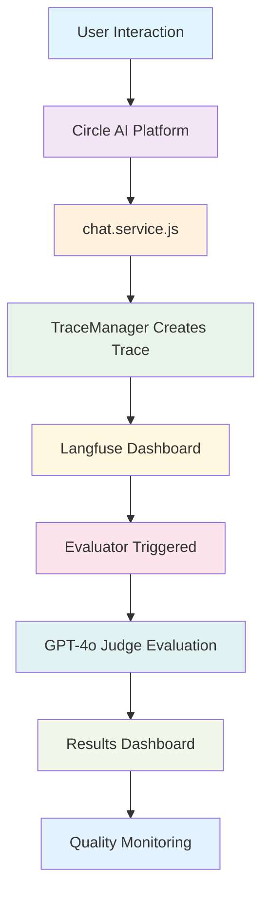
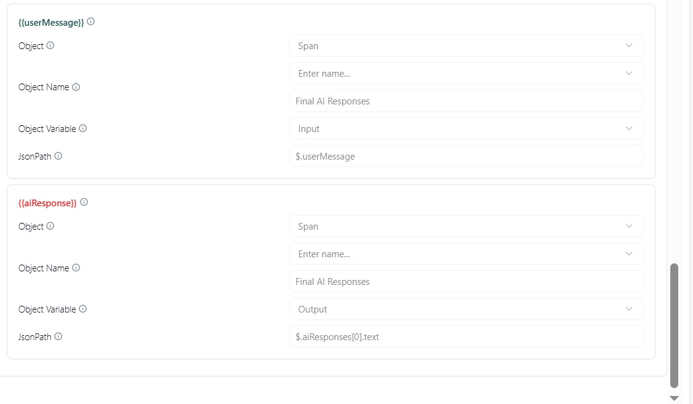
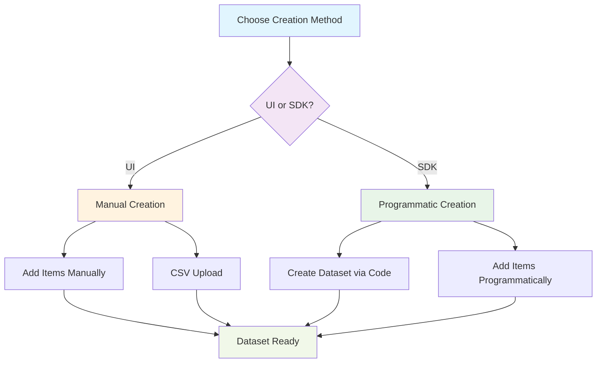
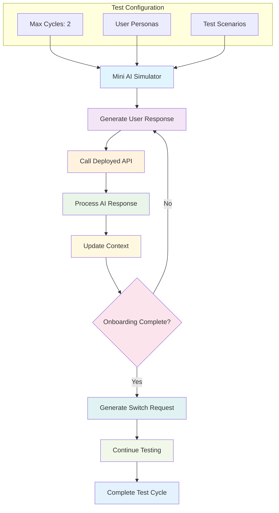

# Circle AI Evaluation Methods Documentation

## Overview

Circle AI implements three comprehensive evaluation methods to ensure high-quality user experiences and continuous platform improvement:

1. **LLM-as-a-Judge Evaluation** - Real-time quality assessment using AI judges
2. **Langfuse Dataset Evaluation** - Systematic testing with predefined test cases
3. **Mini AI User Simulator** - Automated end-to-end testing with simulated users

This document provides detailed implementation guides, configuration examples, and monitoring strategies for each evaluation method.

---

## Table of Contents

- [LLM-as-a-Judge Evaluation](#llm-as-a-judge-evaluation)
- [Langfuse Dataset Evaluation](#langfuse-dataset-evaluation)
- [Mini AI User Simulator](#mini-ai-user-simulator)
- [Best Practices](#best-practices)

---

## LLM-as-a-Judge Evaluation

### Overview

LLM-as-a-Judge evaluation provides real-time quality assessment of user interactions using AI-powered judges. Every user interaction is automatically evaluated for clarity, relevance, helpfulness, medical accuracy, and user experience.

### How It Works



### Real-Time Evaluation Flow

1. **User interacts** with Circle AI platform
2. **Your `chat.service.js`** creates traces with metadata
3. **Langfuse automatically** detects new traces
4. **Evaluator triggers** based on your configuration
5. **GPT-4o judge** evaluates the interaction
6. **Results appear** in Langfuse dashboard in real-time

### Trace Logging Integration

The evaluation system leverages your existing `TraceManager` implementation:

```javascript
// In chat.service.js - TraceManager initialization
traceManager = new TraceManager({
  name: "Circle AI chat",
  userId: userId,
  metadata: {
    role: updatedMetadata.roleCapabilities?.[0],
    mission: updatedMetadata.activeMission || updatedMetadata.selectedMission?.[0],
    chatHistory: messages.map(msg => `${msg.sender}: ${msg.text}`).join('\n'),
    userMessage: messages[messages.length - 1]?.text,
    aiResponse: aiResponses[0]?.text
  }
});
```

### Evaluation Prompt Templates

#### Main Evaluation Prompt

```
You are an expert evaluator assessing a medical education platform's chat system.

CONTEXT:
- Role: {{input.role}}
- Looking for: {{input.mission}}
- Chat History: {{input.chatHistory}}
- Current User Message: "{{input.userMessage}}"
- AI Response: "{{input.aiResponse}}"

EVALUATION CRITERIA:
1. **Clarity** (1-10): Is the AI's response clear and understandable?
2. **Relevance** (1-10): Does the response address the user's specific needs?
3. **Helpfulness** (1-10): Does the response guide the user effectively?
4. **Medical Accuracy** (1-10): Is any medical information accurate and appropriate?
5. **User Experience** (1-10): Does it feel natural, engaging, and professional?

Rate each criterion 1-10 and provide a brief explanation for each score.
```

#### Score Reasoning Prompt

```
Explain your reasoning for the score by briefly summarizing the AI's performance across the criteria of Clarity, Relevance, Helpfulness, Medical Accuracy, and User Experience.
```

#### Score Range Prompt

```
Based on your evaluation across all criteria, provide a single numeric score between 0 and 1, where 0 indicates a completely unsatisfactory response and 1 indicates an excellent, fully satisfactory response.
```

### Variable Mapping Configuration

Configure these variables in the Langfuse dashboard:

| Variable Name | Object | Object Variable | JsonPath |
|---------------|--------|-----------------|----------|
| `role` | Trace | Metadata | `$.role` |
| `mission` | Trace | Metadata | `$.mission` |
| `chatHistory` | Trace | Metadata | `$.chatHistory` |
| `userMessage` | Trace | Metadata | `$.userMessage` |
| `aiResponse` | Trace | Metadata | `$.aiResponse` |

### Dashboard Monitoring

The Langfuse dashboard provides real-time insights:

- **Live Traces**: New user interactions appear instantly
- **Evaluation Scores**: 0-1 scores for each interaction
- **Detailed Explanations**: Why each score was given
- **Trend Analysis**: Quality improvements over time
- **Filtering**: View by role, mission, or time period


### Evaluations Interface

The evaluations section shows detailed results and scoring:


### Prompt Configuration with Placeholders

The evaluation prompt setup includes variable placeholders for dynamic data:


### Variable Placeholders Configuration

Configure how variables are extracted from your traces:



---

## Langfuse Dataset Evaluation

### Dataset Creation Flow



### Dataset Creation Methods

#### **UI-Based Creation**
- Navigate to Langfuse dashboard → Datasets section
- Create dataset with metadata: `{"version": "1.0", "tags": ["onboarding"]}`
- Add items via manual entry, CSV upload, or production mining

#### **SDK-Based Creation**
```javascript
import { LangfuseClient } from "@langfuse/langfuse";

const langfuse = new LangfuseClient({
  publicKey: process.env.LANGFUSE_PUBLIC_KEY,
  secretKey: process.env.LANGFUSE_SECRET_KEY
});

// Create dataset
await langfuse.createDataset({
  name: "circle_ai_onboarding_tests",
  description: "Test cases for Circle AI onboarding flow",
  metadata: { version: "1.0", tags: ["onboarding"] }
});

// Add test cases
await langfuse.createDatasetItem({
  datasetName: "circle_ai_onboarding_tests",
  input: { userId: "test_user", messages: [...], metadata: {...} },
  expectedOutput: { aiResponses: [...], metadata: {...} },
  metadata: { scenario: "tutor_onboarding", userType: "tutor" }
});
```

#### **Integration with Mini AI Simulator**
```javascript
// Extend conversation-loop-endpoint-test.js
const createDatasetFromMiniAI = async (testResults) => {
  await langfuse.createDataset({
    name: "mini_ai_simulator_results",
    description: "Test cases generated by Mini AI simulator"
  });
  
  for (const result of testResults.results) {
    await langfuse.createDatasetItem({
      datasetName: "mini_ai_simulator_results",
      input: { userId: result.userId, messages: result.messageHistory },
      expectedOutput: { aiResponses: result.aiResponses, matches: result.matches },
      metadata: { testType: "mini_ai_simulation" }
    });
  }
};
```

### Dataset Categories

- **Onboarding Scenarios**: Mission selection, role definition, facet collection
- **User Types**: Students, tutors, mentors with different interaction patterns
- **Edge Cases**: Unusual inputs, error handling, boundary conditions
- **Quality Scenarios**: High-quality benchmarks, problematic interactions


---

## Mini AI User Simulator

### Overview

The Mini AI User Simulator provides automated end-to-end testing by simulating realistic user interactions. This method tests the complete user journey from onboarding to completion.

### Simulator Architecture



### Implementation Details

#### Core Simulator Service

```javascript
// mini-ai-user-simulator.service.js
async function generateUserResponse({ metadata, messages, currentQuestion }) {
  const prompt = generateMiniAIUserSimulatorPrompt(metadata);
  
  const fullPrompt = `${prompt}

CONVERSATION CONTEXT:
${messages.map(msg => `${msg.sender}: ${msg.text}`).join('\n')}

CURRENT QUESTION FROM AI:
${currentQuestion}

INSTRUCTIONS:
- Respond as a realistic user would
- Be natural and conversational
- Keep your response brief but complete
- Be consistent with your chosen role and mission

Your response:`;

  const response = await openai.chat.completions.create({
    model: 'gpt-4o-mini',
    messages: [{ role: 'system', content: fullPrompt }],
    max_tokens: 100,
    temperature: 0.7
  });

  return response.choices[0]?.message?.content?.trim() || '';
}
```

#### Conversation Loop Testing

```javascript
// conversation-loop-endpoint-test.js
const runConversationLoopWithEndpoint = async (maxOnboardingCycles = 1) => {
  const userId = 'conversation-endpoint-test-user';
  let currentMetadata = {
    currentPhase: 'mission_selection',
    isOnboardingComplete: false,
    // ... other metadata
  };
  
  let messageBuffer = [];
  let exchangeCount = 0;
  
  while (exchangeCount < maxExchanges && onboardingCyclesCompleted < maxOnboardingCycles) {
    // Generate user response
    const nextUserMessage = await generateUserResponse({
      metadata: currentMetadata,
      messages: messageBuffer,
      currentQuestion: result.aiResponses[result.aiResponses.length - 1]
    });
    
    // Call deployed endpoint
    const result = await callChatEndpoint(userId, messageBuffer, currentMetadata);
    
    // Update metadata and continue
    currentMetadata = result.metadata;
    messageBuffer.push({
      messageId: `user-msg-${exchangeCount + 1}`,
      sender: 'user',
      text: nextUserMessage,
      timestamp: Date.now()
    });
    
    exchangeCount++;
  }
  
  return {
    success: true,
    finalMetadata: currentMetadata,
    totalExchanges: exchangeCount,
    messageHistory: messageBuffer
  };
};
```

### Test Scenarios

The simulator supports various test scenarios:

1. **Onboarding Flow**: Complete user onboarding from mission selection to completion
2. **Role Switching**: Test users switching between different roles
3. **Edge Cases**: Handle unusual user inputs and responses
4. **Performance Testing**: Stress test with multiple concurrent users


### Integration with Langfuse Datasets

The conversation loop test can be modified to load datasets from Langfuse and test the system:

```javascript
// Modified conversation-loop-endpoint-test.js
const { LangfuseClient } = require('@langfuse/langfuse');

const langfuse = new LangfuseClient({
  publicKey: process.env.LANGFUSE_PUBLIC_KEY,
  secretKey: process.env.LANGFUSE_SECRET_KEY
});

const runDatasetTest = async (datasetName) => {
  // Load dataset from Langfuse
  const dataset = await langfuse.getDataset(datasetName);
  
  for (const item of dataset.items) {
    // Use dataset item as test case
    const result = await callChatEndpoint(
      item.input.userId, 
      item.input.messages, 
      item.input.metadata
    );
    
    // Compare with expected output
    const evaluation = compareResults(result, item.expectedOutput);
    
    // Log results
    console.log(`Test case ${item.id}: ${evaluation.passed ? 'PASSED' : 'FAILED'}`);
  }
};

// Usage: runDatasetTest('circle_ai_onboarding_tests')
```

This approach allows you to:
- **Load test cases** from Langfuse datasets
- **Run systematic tests** against your system
- **Compare results** with expected outputs
- **Track performance** across different test scenarios

---

## Best Practices

### 1. Evaluation Strategy

- **Combine Methods**: Use all three evaluation approaches for comprehensive coverage
- **Regular Monitoring**: Set up weekly quality reviews
- **Trend Analysis**: Track improvements over time
- **Action Items**: Create improvement tasks based on results

### 2. Implementation Guidelines

- **Start Simple**: Begin with LLM-as-a-Judge for immediate insights
- **Gradual Expansion**: Add dataset evaluation for systematic testing
- **Full Testing**: Implement Mini AI simulator for comprehensive coverage
- **Continuous Improvement**: Refine evaluation criteria based on results

### 3. Monitoring & Alerts

- **Real-time Dashboards**: Monitor quality metrics continuously
- **Automated Alerts**: Set up notifications for quality issues
- **Regular Reviews**: Schedule weekly evaluation result analysis
- **Performance Tracking**: Monitor evaluation system performance

### 4. Documentation Maintenance

- **Update Prompts**: Refine evaluation criteria based on results
- **Version Control**: Track changes to evaluation methods
- **Team Training**: Ensure team understands evaluation processes
- **Continuous Learning**: Improve based on evaluation insights

---

## Conclusion

The three evaluation methods work together to provide comprehensive quality assurance for the Circle AI platform:

- **LLM-as-a-Judge** ensures real-time quality monitoring
- **Dataset Evaluation** provides systematic testing capabilities
- **Mini AI Simulator** enables end-to-end testing with realistic scenarios

By implementing all three methods, you achieve complete coverage of your platform's quality assurance needs while maintaining cost-effectiveness and scalability.

---
